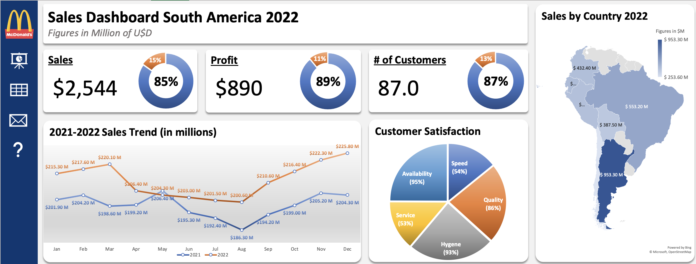
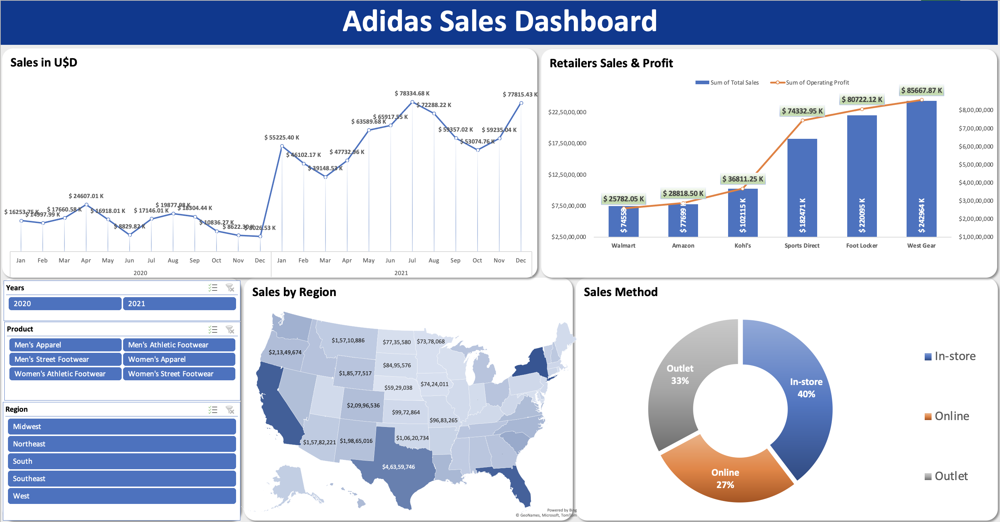

 

This repo on Data Analytics In Excel will help to understand the various crucial functions available in Excel, such as vlookup, hlookup, sumif/s, counif/s, iferror and others. Finally, you will see how to use the Data Analysis Toolpak to perform various data analysis operations such as:

1. Basic of excel  <a href="./Basic function/12 most useful excel formulas.xlsx"> Excel Function </a>
    - **Advance Excel Pratice file:**  ](./Basic%20function/conditional.png)


2. Lookup & functions [Lookup](//https://1drv.ms/x/c/8cde32f38b783a7a/EZ6eynUCjmFCrlA68pgYsHkBpu3LO5XnOzSP14CNtcfHtQ?e=usRgXX)

3. Conditional formating [](./Basic%20function/Conditional%20formatitng.xlsx)

4. Data validation [](./Basic%20function/Data%20Validation.xlsx)

5. Sorting and filtering [](./Basic%20function/sort%20data%20filter.xlsx)

6. Data analysis using toolpak


## Dashboard

**Ecommerce-Sales-Analysis**
```
An Ecommerce Sales Analysis Dashboard showcasing proficient data analysis in Microsoft Excel. Gain insights into sales, profit, regional performance, category-wise profitability, top-selling subcategories, and a pie chart analysis of ecommerce sales composition. This project offers a data-driven approach to decision-making within the ecommerce sector, aiding in revenue optimization and strategic planning
```

[](./Project/E_comer_sales_Dashboard.xlsx)

**MacDonald Sales**

Discover the 'MacDonald's Sales 2022 Dashboard,' a project that offers a comprehensive analysis of sales and customer-related data within the fast-food industry. This analysis includes insights into sales, profit, and the number of customers, a sales trend graph comparing 2021 to 2022, a pie chart of customer satisfaction, and a breakdown of sales by country in 2022. Gain valuable insights into financial performance, year-over-year trends, and customer sentiment to enhance strategic decision-making for MacDonald's

[](./Project/MacDonald%20Sales%20Analysis%20Dashboard.xlsx)


**Adidas Sales Analysis**

Explore the 'Adidas Sales Analysis Dashboard' project, which offers an in-depth analysis of Adidas's sales performance. This analysis includes sales in USD ($), sales by region, and sales by method, providing insights into financial performance and distribution strategies. Additionally, a bar graph visualizes retailer sales and profit, helping to identify key contributors to overall sales and profitability in the sportswear industry

[](./Project/Adidas-Sales-Analysis.xlsx)

***SalesDashboad*** [](./Project/Sales%20Data_Dashboard.xlsx)

***D Mart*** [](./Project/Dmart%20Excel%20Dashboard/DMart%20Sales%20Dashboard%202024.xlsx)

***Sales Superstore Sample: Sales Performance Dashboard***
[](./Project/superstore_SalesDashboard.xlsx)


### document writing in ms word google docs 

](./Books.GIF)

### ppt presentation templates

](./ppt.GIF)

](./ppt/ppt.png)


**connect with me :**

**Name:-** Subham Kumar
**Email:-** kumarsubham0734@gmail.com
**Linkden:-** https://www.linkedin.com/in/ksubham/