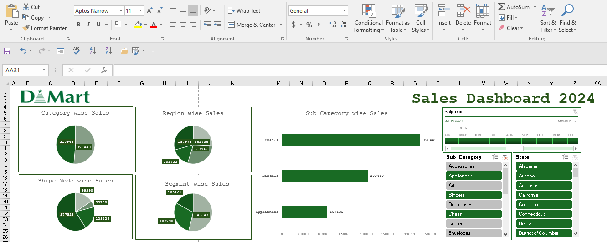
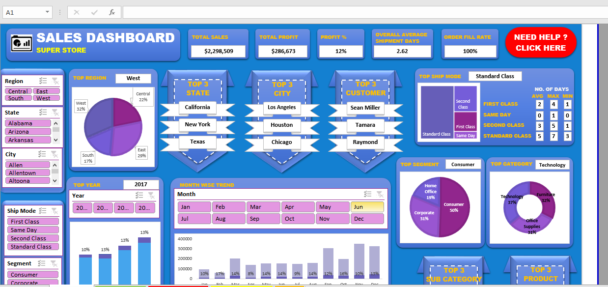

 

This repo on Data Analytics In Excel will help to understand the various crucial functions available in Excel, such as vlookup, hlookup, sumif/s, counif/s, iferror and others. Finally, you will see how to use the Data Analysis Toolpak to perform various data analysis operations such as:

1. Basic of excel  <a href="./Basic function/12 most useful excel formulas.xlsx"> Excel Function </a>
    - **Advance Excel Pratice file:**  ](./Basic%20function/conditional.png)
2. Lookup & functions [Lookup](//https://1drv.ms/x/c/8cde32f38b783a7a/EZ6eynUCjmFCrlA68pgYsHkBpu3LO5XnOzSP14CNtcfHtQ?e=usRgXX)

<a href=" https://1drv.ms/x/c/8cde32f38b783a7a/EZ6eynUCjmFCrlA68pgYsHkBpu3LO5XnOzSP14CNtcfHtQ?e=s7CPJw"> Link </a>

3. Conditional formating 

4. Data validation 

5. Sorting and filtering 

6. Data analysis using toolpak

## Dashboard

- ***SalesDashboad*** 

- ***D Mart*** 

-  ***Sales Superstore Sample: Sales Performance Dashboard***

### document writing in ms word google docs 

](./Books.GIF)

### ppt presentation templates

](./ppt.GIF)

](./ppt/ppt.png)

